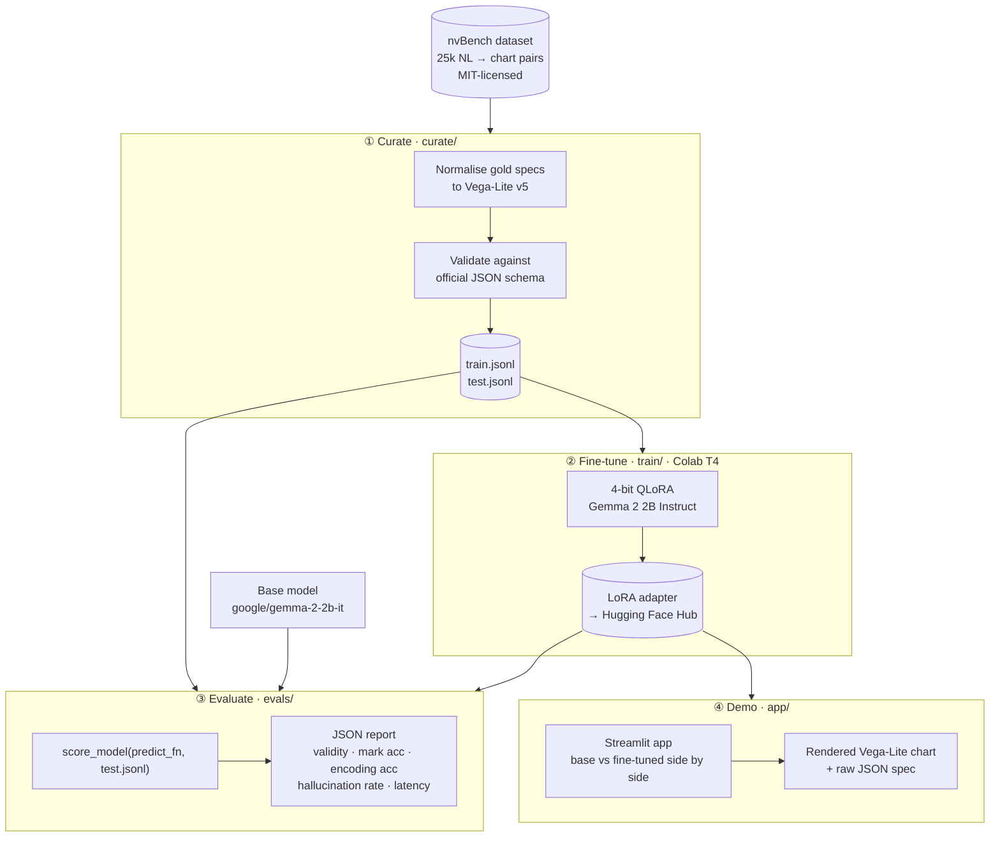

# LLM Fine-Tuning Harness — NL to Vega-Lite

Most fine-tuning write-ups end at "the loss went down." This one measures what that means.

The task: given a plain-English question and a small table, generate a valid [Vega-Lite](https://vega.github.io/vega-lite/) chart specification. A structured eval suite then scores any predictor — base model, fine-tuned adapter, or a different base entirely — across validity, chart-type accuracy, encoding correctness, and hallucination rate. Lift from fine-tuning is measured, not asserted.

**[→ Live demo](https://llm-fine-tuning-jkrrznyhh4hswqchybn8an.streamlit.app/)** — pick a sample question, see both the rendered chart and the raw Vega-Lite JSON for the base and fine-tuned models side by side.

## Why this project matters

Most fine-tuning tutorials hand you a loss curve and call it done. This project goes further: it defines what "better" actually means, measures it automatically, and makes the lift visible to anyone who opens the demo. That end-to-end rigor — curate, train, measure, show — is what separates a reproducible result from a vibes-based claim.

**The task is a perfect stress test for structured-output fine-tuning.** Natural-language → Vega-Lite gives you automatic correctness at every layer:

- The output must parse as valid JSON and pass the published Vega-Lite v5 schema — no human grader needed for the correctness floor.
- Every field reference must match a column that actually exists in the supplied table — any invented name is a measurable hallucination, caught programmatically.
- The `mark` type (`bar`, `line`, `point`, …) is a clean proxy for tool selection; the encoding channels are the tool arguments. Fine-tuning can be scored on both independently.

That lets the eval suite produce hard numbers — not impressions — for every model you throw at it.

**The methodology transfers directly to any structured-output problem.** Swap the dataset and schema, keep the pipeline:

| Domain | NL input | Structured target | Auto-checkable signals |
|--------|----------|-------------------|------------------------|
| Data analytics | Plain-English question | Vega-Lite chart spec *(this project)* | Schema validity, column hallucination, mark type |
| Database tooling | Plain-English query | SQL | Syntax validity, table/column hallucination, query equivalence |
| API automation | User intent | REST / GraphQL call | Schema validity, required fields, auth scope |
| UI generation | Feature description | React / Tailwind component | Linting, prop type checking, render errors |
| Config management | Plain-English policy | YAML / JSON config | Schema validation, value-range checks |

The curate → fine-tune → evaluate → demo skeleton is reusable as-is. Replace `curate/prepare.py` with your own data pipeline, point the eval runner at your schema, and you have a rigorous fine-tuning harness for any task where correctness is checkable without annotation.

**It runs entirely on free infrastructure.** Training on a free Colab T4 with 4-bit QLoRA keeps the GPU cost at zero. Eval and the demo run on local CPU or Apple Silicon. Every model and dataset is openly licensed. There are no paid API calls anywhere in the pipeline — which means the full experiment is reproducible by anyone with a laptop and a Google account.

## Pipeline

Four independently runnable stages:

| Stage | Package | What it does |
|-------|---------|--------------|
| 1. Curate | `curate/` | Stream [nvBench](https://github.com/TsinghuaDatabaseGroup/nvBench), normalise gold specs to Vega-Lite v5, validate against the official JSON schema, write deterministic train/test JSONL splits. |
| 2. Fine-tune | `train/` + Colab notebook | 4-bit QLoRA fine-tuning of [Gemma 2 2B Instruct](https://huggingface.co/google/gemma-2-2b-it) on the free Colab T4 tier using `peft` + `trl` + `bitsandbytes`. |
| 3. Evaluate | `evals/` | Score any `predict_fn(question, schema) → dict` against the curated test set; produces a JSON summary across five metrics. |
| 4. Demo | `app/` | Streamlit app: question + dataset → side-by-side chart and raw spec for base and fine-tuned models. |

The eval package is intentionally decoupled from training. It accepts any predictor, so the same harness scores the base model, the fine-tuned adapter, and future checkpoints on identical inputs — no leakage, fair comparison.

## Eval metrics

| Metric | What it measures |
|--------|-----------------|
| **Validity rate** | Fraction of outputs that pass the Vega-Lite v5 JSON schema — the correctness floor. |
| **Mark accuracy** | Predicted chart type matches gold. `mark` is the rendering primitive — the "tool." |
| **Encoding-field accuracy** | Per-channel match of `field` values against gold — the tool arguments. |
| **Hallucination rate** | Fraction of encoded fields that don't appear in the question's schema. |
| **Latency** | Mean / p50 / p95 in milliseconds. |

## Stack

| Stage | Tools |
|-------|-------|
| Curation | `datasets`, `jsonschema`, `pandas` |
| Training | `transformers`, `peft`, `trl`, `bitsandbytes`, `accelerate` (CUDA, Colab) |
| Evaluation | `jsonschema`, `pandas`, custom metrics |
| Demo | `streamlit`, `transformers` (CPU / MPS inference) |

- **Base model:** [`google/gemma-2-2b-it`](https://huggingface.co/google/gemma-2-2b-it)
- **Dataset:** nvBench via [`TianqiLuo/nvBench2.0`](https://huggingface.co/datasets/TianqiLuo/nvBench2.0) (MIT-licensed)
- **Env manager:** [`uv`](https://docs.astral.sh/uv/) with `pyproject.toml` + `uv.lock`

Everything runs on free tiers — free Colab T4 for training, local CPU or Apple Silicon for eval and the demo, openly licensed models and data throughout.

## Setup

Requires Python 3.11+ and [uv](https://docs.astral.sh/uv/).

```bash
uv sync                     # core deps (curate + eval + inference)
uv sync --group train       # CUDA-only training deps (Colab)
uv sync --group demo        # Streamlit
uv sync --group dev         # pytest + ruff

cp .env.example .env
```

## Usage

### 1. Curate

```bash
uv run python -m curate.prepare
```

Writes `data/nvbench_train.jsonl` and `data/nvbench_test.jsonl`. Each line: question, column schema, validated Vega-Lite v5 gold spec.

### 2. Fine-tune (Colab)

Open [`notebooks/train_colab.ipynb`](notebooks/train_colab.ipynb) in Colab. The notebook 4-bit-quantises Gemma 2 2B, attaches LoRA adapters via `peft`, runs supervised fine-tuning with `trl.SFTTrainer`, and exports the adapter to Drive or the Hugging Face Hub.

### 3. Evaluate

```python
from evals.runner import score_model

summary = score_model(
    predict_fn=my_model.predict,        # (question, schema) -> spec dict
    test_path="data/nvbench_test.jsonl",
    output_path="runs/my_model.json",
)
```

Run the same call on the base model and the fine-tuned adapter to compare them on identical inputs.

### 4. Demo

```bash
uv run streamlit run app/streamlit_app.py
```

Or visit the [live demo](https://llm-fine-tuning-jkrrznyhh4hswqchybn8an.streamlit.app/). Set `HF_MODEL_ID` to your adapter's Hugging Face repo ID to load the trained model; the demo falls back gracefully to a heuristic placeholder while the adapter trains.

## Status

| Stage | State |
|-------|-------|
| Curate | Complete — `uv run python -m curate.prepare` produces validated splits end-to-end. |
| Fine-tune | Training in progress. |
| Evaluate | Complete — harness tested and ready to score any predictor. |
| Demo | Live — runs a heuristic baseline today; hot-swaps to the trained adapter once available. |

## Project layout

```
curate/      Stage 1 — dataset preparation and Vega-Lite schema validation
train/       Stage 2 — fine-tuning (used by the Colab notebook)
evals/       Stage 3 — scoring suite (named `evals` to avoid shadowing built-in `eval`)
app/         Stage 4 — Streamlit demo
notebooks/   Colab training notebook
tests/       pytest suite
data/        Curated splits + cached Vega-Lite schema (gitignored)
```

## Architecture



## License

[MIT](LICENSE). The nvBench dataset is also MIT-licensed.
